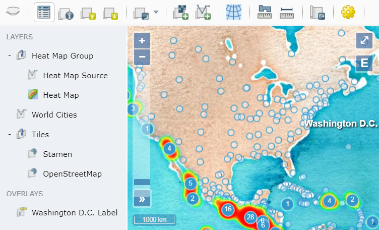

# OpenLayers Explorer

[](https://travis-ci.org/dpmcmlxxvi/olexp)
[](https://coveralls.io/github/dpmcmlxxvi/olexp?branch=master)
[](https://www.codacy.com/app/dpmcmlxxvi/olexp?utm_source=github.com&amp;utm_medium=referral&amp;utm_content=dpmcmlxxvi/olexp&amp;utm_campaign=Badge_Grade)
[](https://badge.fury.io/js/olexp)
[](https://david-dm.org/dpmcmlxxvi/olexp)
[](https://david-dm.org/dpmcmlxxvi/olexp/master#info=devDependencies)
[](https://greenkeeper.io/)
[](http://gruntjs.com/)

OpenLayers Explorer (olexp) is a Javascript library that combines the mapping
power of [OpenLayers](http://openlayers.org/) and the layout management of
[w2ui](http://w2ui.com). The olexp library can be used to create web
applications to explore spatial data. The library provides an out-of-the-box
solution to display map content along with easy-to-use common interface tools -
a layer manager and a toolbar.



## DOCUMENTATION

The following help is available at the olexp
[website](http://dpmcmlxxvi.github.io/olexp):

- [Documentation](http://dpmcmlxxvi.github.io/olexp/web/)
- [Examples](http://dpmcmlxxvi.github.io/olexp/web/demos.html)
- [API](http://dpmcmlxxvi.github.io/olexp/api/)

## BUILD

To build and test the library locally:

```shell
npm install
npm test
```

Then bundled library and stylesheet are at `dist/olexp.min.js` and
`dist/olexp.min.css`.

## LICENSE

Copyright (c) 2015 Daniel Pulido <mailto:dpmcmlxxvi@gmail.com>

Source code is released under the [MIT License](http://opensource.org/licenses/MIT).
Documentation is released under the [CC BY 4.0](http://creativecommons.org/licenses/by-sa/4.0/).
Icons are from [OSGeo](http://trac.osgeo.org/osgeo/wiki) and released under the
[CC BY 4.0](http://creativecommons.org/licenses/by-sa/4.0/).
